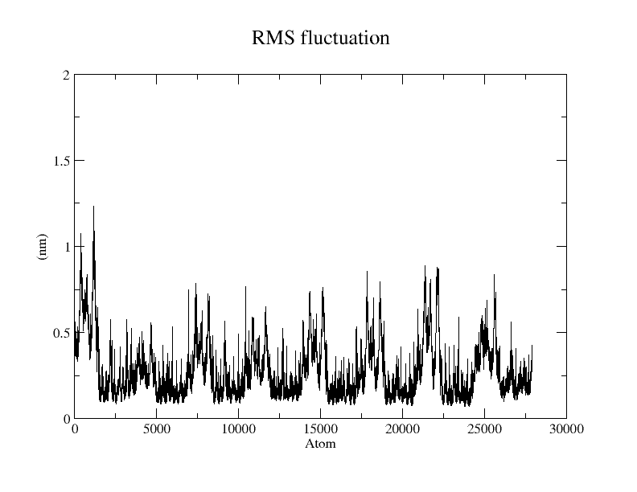

# **Molecular Dynamics Simulations Using GROMACS: A Beginner’s Guide**


## **1: Introduction to Molecular Dynamics**

Molecular Dynamics (MD) simulations allow us to study the physical movements of atoms and molecules by numerically solving Newton's equations of motion.  
This guide provides a step-by-step method for setting up, running, and analyzing MD simulations using **GROMACS**, a widely-used open-source MD simulation software package.


## **2: Installation of GROMACS**

### **2.1 Installation for CPU-Based Simulations**

To install GROMACS optimized for CPU-based simulations, use the following commands:

```bash
sudo apt update
sudo apt upgrade
sudo apt install gcc cmake build-essential libfftw3-dev gromacs python3-venv python3-pip
```

Once the installation is complete, confirm it by checking the version:

```bash
gmx --version
```

This installation is sufficient for running simulations entirely on the CPU. If you encounter errors during installation, such as missing dependencies, ensure that your system is up-to-date and that required libraries are installed.


### **2.2 Installation for GPU-Accelerated Simulations (NVIDIA GPUs)**

For systems with NVIDIA GPUs, you will need the appropriate drivers and libraries to fully utilize GPU acceleration. Follow these steps:

```bash
sudo apt update && sudo apt upgrade -y
sudo apt install -y build-essential dkms curl wget git cmake freeglut3-dev libglew-dev libgl1-mesa-dev libglu1-mesa-dev
sudo add-apt-repository -y ppa:graphics-drivers/ppa
sudo apt update
sudo ubuntu-drivers install
sudo apt install -y nvidia-cuda-toolkit
sudo apt install -y libcudnn9-cuda-12 libcudnn9-dev-cuda-12
sudo apt install ocl-icd-libopencl1 opencl-headers intel-opencl-icd libopenmpi-dev openmpi-bin
sudo apt install -y python3-venv python3-pip
```

This installs the following components:
- Latest NVIDIA GPU drivers
- CUDA toolkit
- cuDNN libraries (for deep optimizations)
- Development tools (CMake, Git)

**Reboot** the system after installation to apply driver changes. If you encounter any GPU-specific issues, such as driver conflicts or unsupported GPU models, check NVIDIA's official documentation for troubleshooting steps.


### **2.3 Installation from Source (with CUDA, OpenCL, and MPI Support)**

For advanced users who wish to compile GROMACS from source with GPU acceleration and MPI multi-node support, follow these steps:

```bash
wget https://ftp.gromacs.org/gromacs/gromacs-2025.1.tar.gz
tar xfz gromacs-2025.1.tar.gz
cd gromacs-2025.1
mkdir build
cd build
cmake .. -DGMX_BUILD_OWN_FFTW=ON -DREGRESSIONTEST_DOWNLOAD=ON -DGMX_MPI=on -DGMX_GPU=CUDA -DGMX_GPU=OpenCL
make -j$(nproc)
make check -j$(nproc)
sudo make install
```

### Explanation of important options:
- `GMX_BUILD_OWN_FFTW=ON`: Builds the internal FFTW library.
- `GMX_MPI=on`: Enables MPI for parallel simulations across multiple cores or nodes.
- `GMX_GPU=CUDA`/`GMX_GPU=OpenCL`: Enables GPU acceleration for NVIDIA GPUs (CUDA) or broader GPU support (OpenCL).

After installation, source the GROMACS environment:

```bash
source /usr/local/gromacs/bin/GMXRC
```

This ensures that GROMACS commands such as `gmx` are available in the terminal.


## **3: Preparing Your System**

### **3.1 Generating Topology Files**

Convert your protein structure file (`protein.pdb`) into a GROMACS-compatible format:

```bash
gmx pdb2gmx -f protein.pdb -o processed.gro -water tip3p
```

If your `.pdb` file contains hydrogen atoms you wish to ignore:

```bash
gmx pdb2gmx -f protein.pdb -o processed.gro -water tip3p -ignh
```

### **3.2 Defining the Simulation Box**

Center your protein in a simulation box and define the box type and size. The following command generates a **cubic** box with a 1.0 nm distance between the protein and the box edges:

```bash
gmx editconf -f processed.gro -o newbox.gro -c -d 1.0 -bt cubic
```

#### **Choosing Different Box Types**

GROMACS offers several box types that might be useful for specific systems:

| Box Type   | Flag                | Description                                       |
|:--|:--|:-|
| Cubic      | `-bt cubic`         | A cube-shaped box (default).                     |
| Triclinic  | `-bt triclinic`     | A general parallelepiped; good for compact packing.|
| Octahedron | `-bt octahedron`    | A truncated octahedron; reduces solvent molecules. |
| Dodecahedron | `-bt dodecahedron` | A rhombic dodecahedron; efficient for spherical solutes. |

**Example**:  
To create a **dodecahedral box**, use:

```bash
gmx editconf -f processed.gro -o newbox.gro -c -d 1.0 -bt dodecahedron
```

### **3.3 Solvating the System**

Fill the box with water molecules:

```bash
gmx solvate -cp newbox.gro -cs spc216.gro -o solvated.gro -p topol.top
```


## **4: Adding Ions**

Prepare the system for ion addition:

```bash
gmx grompp -f ions.mdp -c solvated.gro -p topol.top -o ions.tpr
```

Add ions to neutralize the system:

```bash
gmx genion -s ions.tpr -o solvated_ions.gro -p topol.top -pname NA -nname CL -neutral
```

Note: If you need a specific ion concentration (e.g., for physiological simulations), consider adjusting the concentration using the `-conc` flag or refer to GROMACS documentation for more details.


## **5: Energy Minimization (EM)**

Minimize the system’s energy to remove bad contacts:

```bash
gmx grompp -f em.mdp -c solvated_ions.gro -p topol.top -o em.tpr
gmx mdrun -v -deffnm em
```

- **Integrator**: steep
- **Goal**: Relax the structure to a local energy minimum.


## **6: Equilibration Phases**

### **6.1 NVT Equilibration (Constant Number, Volume, and Temperature)**

Perform temperature equilibration:

```bash
gmx grompp -f nvt.mdp -c em.gro -r em.gro -p topol.top -o nvt.tpr
gmx mdrun -deffnm nvt
```

- **Temperature**: 300 K
- **Velocities**: Newly generated (`gen_vel = yes`).

### **6.2 NPT Equilibration (Constant Number, Pressure, and Temperature)**

Perform pressure equilibration:

```bash
gmx grompp -f npt.mdp -c nvt.gro -r nvt.gro -p topol.top -o npt.tpr
gmx mdrun -deffnm npt
```

- **Pressure**: 1 bar
- **Velocities**: Continued from NVT (`gen_vel = no`).


## **7: Production Molecular Dynamics**

Finally, conduct the actual MD simulation:

```bash
gmx grompp -f md.mdp -c npt.gro -p topol.top -o md.tpr
gmx mdrun -deffnm md
```

- **Time Scale**: Defined by the number of steps (`nsteps = 1,000,000`) and the time step (`dt = 0.002 ps`), giving a total simulation time of **2 ns**.
- **Velocities**: Continued (`gen_vel = no`).

To run with GPU acceleration:

```bash
gmx mdrun -deffnm md -nb gpu
```

To pause the simulation, press `Ctrl + C`.  
To resume:

```bash
gmx mdrun -cpi md.cpt -deffnm md
```
To resume a simulation from equilibration phases change md with nvt/npt.


## **8: Basic Trajectory Analysis**

After completing the simulation, analyze key properties:

| Property                                | Command |
|:-|:--|
| Root Mean Square Deviation (RMSD)       | `gmx rms -s md.tpr -f md.xtc -o rmsd.xvg -tu ns` |
| Root Mean Square Fluctuation (RMSF)     | `gmx rmsf -s md.tpr -f md.xtc -o rmsf.xvg` |
| Solvent Accessible Surface Area (SASA)  | `gmx sasa -s md.tpr -f md.xtc -o sasa.xvg` |
| Hydrogen Bonds                          | `gmx hbond -s md.tpr -f md.xtc -num hbond.xvg` |
| System Energy                           | `gmx energy -f md.edr -o energy.xvg` |
| Radius of Gyration                      | `gmx gyrate -s md.tpr -f md.xtc -o gyrate.xvg` |
| System Pressure                         | `gmx energy -f npt.edr -o pressure.xvg` |
| System Density                          | `gmx energy -f npt.edr -o density.xvg` |


## **9: Plotting Results**

### Using Grace
Make sure `gracebat` is installed:

```bash
sudo apt install grace
```

Here’s the **command** you can run **directly in the Ubuntu terminal** to convert your `.xvg` files into `.png` images using `gracebat`:
```bash
for f in density.xvg gyrate.xvg pressure.xvg rmsd.xvg rmsf.xvg sasa.xvg hbond.xvg; do gracebat "$f" -hardcopy -hdevice PNG -printfile "${f%.xvg}.png"; done
```

### Using Python
To visualize the simulation data, use Python and `matplotlib`. First, ensure you have the necessary Python libraries installed:

```bash
pip install matplotlib numpy
```

Then, you can use the following Python code to plot your data:

```python
import matplotlib.pyplot as plt
import numpy as np

def plot_xvg(file, title, xlabel, ylabel):
    data = np.loadtxt(file, comments=['@', '#'])
    plt.plot(data[:, 0], data[:, 1])
    plt.title(title)
    plt.xlabel(xlabel)
    plt.ylabel(ylabel)
    plt.grid()
    plt.show()

plot_xvg('rmsd.xvg', 'RMSD', 'Time (ns)', 'RMSD (nm)')
plot_xvg('rmsf.xvg', 'RMSF', 'Residue', 'RMSF (nm)')
plot_xvg('sasa.xvg', 'SASA', 'Time (ns)', 'SASA (nm²)')
plot_xvg('hbond.xvg', 'Hydrogen Bonds', 'Time (ns)', 'Number of H-bonds')
plot_xvg('energy.xvg', 'Energy', 'Time (ns)', 'Energy (kJ/mol)')
plot_xvg('gyrate.xvg', 'Radius of Gyration', 'Time (ns)', 'Rg (nm)')
plot_xvg('pressure.xvg', 'Pressure', 'Time (ns)', 'Pressure (bar)')
plot_xvg('density.xvg', 'Density', 'Time (ns)', 'Density (g/cm³)')
```

## **10: Summary of the MD Simulation Workflow**

```
1. Prepare the system: pdb2gmx → editconf → solvate → ions
2. Energy minimization: ions.mdp → em.mdp
3. Equilibration: nvt.mdp → npt.mdp
4. Production MD: md.mdp
5. Analysis: GROMACS tools + Python visualization
```

Each phase is critical for achieving a stable, physical, and meaningful molecular dynamics simulation.

## Preview of Simulation of Fish immunogloblin M-Fc with PDB id [8GHZ](https://www.rcsb.org/structure/8GHZ)

Protein In Water(tip3p) Simulation


Protein Simulation(Water Molecules Removed)


## Plots
Examples plots that are generated using grace.

### RMSD Plot


### RMSF Plot


### Radius of Gyration Plot


### H-Bonds Plot


### Pressure Plot


### Density Plot


